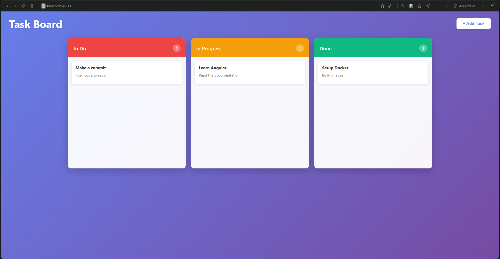
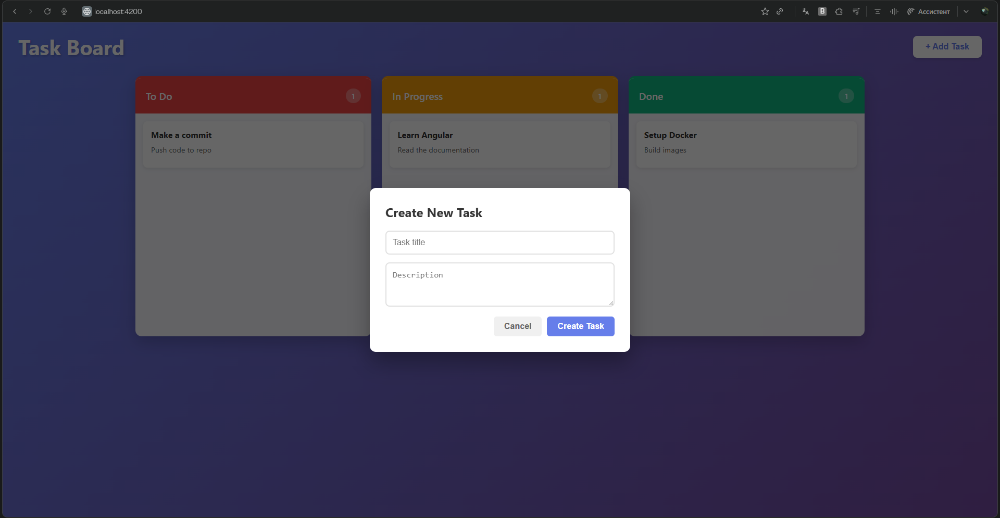

# 📋 Kanban Task Board - Full Stack: ASP.NET Core API + Angular

<div align="center">


Interactive task management board with drag-and-drop functionality and Docker support
</div>

---

## 📖 About

Kanban Task Board is a full-stack web application for managing tasks using the Kanban methodology. It features a responsive Angular frontend with native drag-and-drop support and a robust ASP.NET Core Web API backend. The entire application is containerized with Docker for easy deployment.

---

## ✨ Features

| Feature         | Description                                                    |
|-----------------|----------------------------------------------------------------|
| 🔄 Drag & Drop  | Intuitive drag-and-drop interface to move tasks between columns |
| 📝 Task CRUD    | Create, read, update, and delete tasks easily                  |
| 🏷️ Status Columns | Organize tasks by "To Do", "In Progress", and "Done"        |
| ⚡ Real-time UI | Optimistic UI updates with error rollback                      |
| 🐳 Docker Ready | Fully containerized with docker-compose                        |
| 🎨 Modern UI    | Clean, responsive design with custom styling                   |

---

## 🛠️ Tech Stack

- **Backend**: ASP.NET Core 8 Web API  
- **Frontend**: Angular 18 (Standalone Components)  
- **Web Server**: Nginx (Alpine)  
- **Containerization**: Docker + Docker Compose  
- **Language**: C# 12, TypeScript  

---

## 🚀 Quick Start

### With Docker (recommended)

Ensure you have Docker and Docker Compose installed.

```bash
docker compose up --build
```

Access the application:  
Frontend: http://localhost:4200  
API: http://localhost:8080/api/tasks  

---

## 📡 API Endpoints

| Method | Endpoint                  | Description               | Payload Example                                  |
|--------|---------------------------|---------------------------|--------------------------------------------------|
| GET    | `/api/tasks`              | Get all tasks             | -                                                |
| GET    | `/api/tasks/{id}`         | Get single task by ID     | -                                                |
| POST   | `/api/tasks`              | Create a new task         | `{ "title": "New Task", "description": "Details" }` |
| PUT    | `/api/tasks/{id}`         | Update full task details  | `{ "title": "Updated", "status": "done" }`       |
| PATCH  | `/api/tasks/{id}/status`  | Update task status only   | `{ "status": "inprogress" }`                     |
| DELETE | `/api/tasks/{id}`         | Delete a task             | -                                                |

---

## 📸 Screenshots

<div align="center">


</div>

---

## 🔧 Configuration

The application uses an in-memory data store for simplicity. To persist data across restarts in Docker, you can modify `TasksDataStore.cs` to use a database like SQLite or PostgreSQL.

**Nginx Proxy:**  
The frontend Nginx server is configured to proxy `/api` requests to the backend container automatically.
